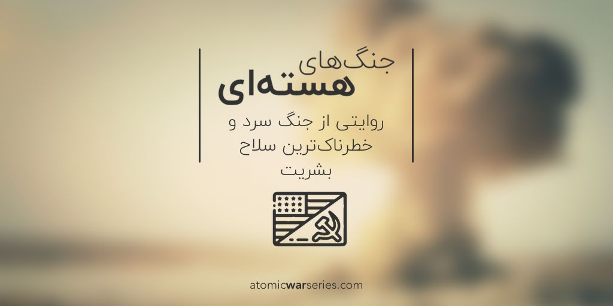

# Atomic Wars Series Podcast

Atomic war series is a __special edition of [StringCast podcast](https://stringcast.ir) in collaboration with [Radio Daal](https://radioDaal.ir)__.

In this six episode podcast, we will explore the _events after second World war_, when US and USSR, two atomic nations, got into the cold war.  

For more information you can visit [Atomic Was Series website](https://atomicwarseries.com/) or see the trailer.

### How does it work?

In the Telegram bot, you can watch the teaser and episode zero of this series.  
After payment in Strip or Zarinpal, episodes will be sent to you weekly.

### Why a Telegram bot

So many people in Iran use Telegram regularly and they already knew how to work with bots.
Telegram provides basic capabilities for listening to podcasts, including playing in double speed and resume an episode where you sopped.
In general, using Telegram could provide better user experience and easier accessibility compared to Web.

## How to run the bot
### Requirments
- Redis
- Mongo

### Run
- Make sure `mongo` and `redis` servers are running
- Provide required entries in `.env` file, including `BOT_TOKEN` and payments keys
- Use `ngrok` to open a tunnel to bot port (default to 3000)
- Enter address in `.env` file as `SERVER_URL`
- Run `npm start`

#### Promo code
Copy `src/promo.sample` to `data/promo.txt` file and modify it

#### Translation
I've used [i18n-editor](https://github.com/jcbvm/i18n-editor/releases) to generate translations files

### Test
- Use `4242 4242 4242 4242` for testing Stripe
